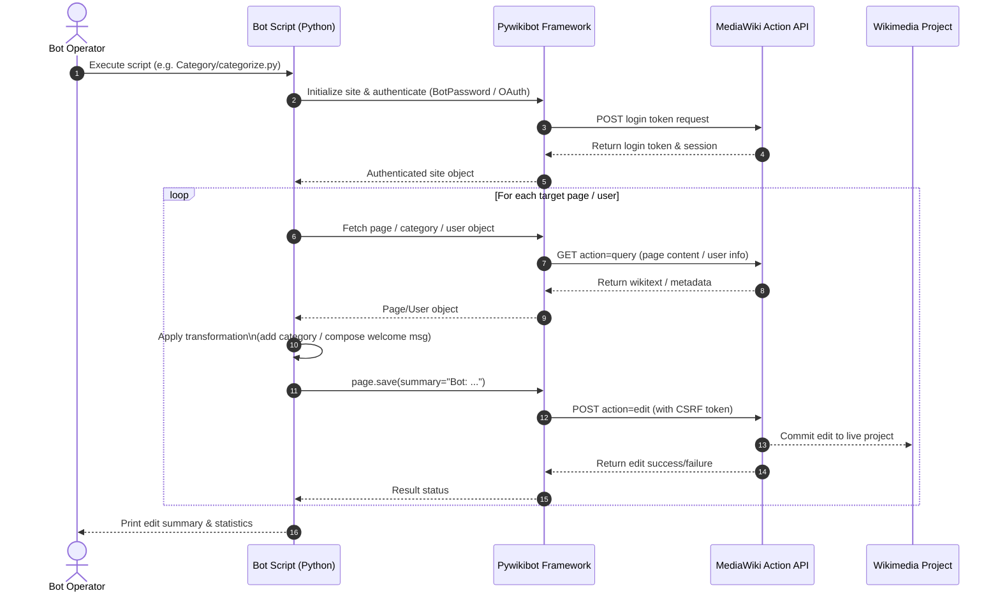
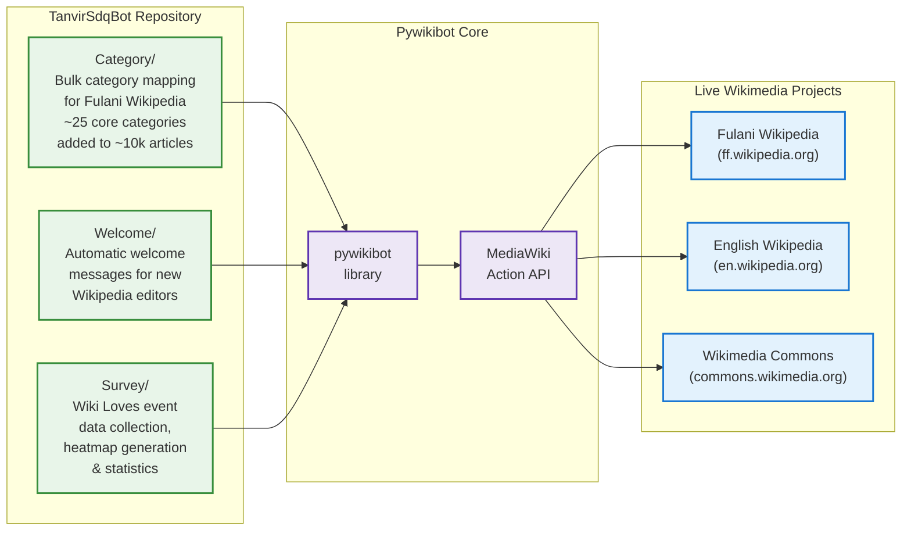

# TanvirSdqBot — Wikimedia Automation Tools

Python-based bots and scripts developed as part of **NDEC WERT** (Notre Dame College Wikimedia Editorial & Research Team) to support Wikipedia and Wikidata editing in 2024.

**Main achievements using these tools:**
- Structured the newly created Fulani Wikipedia (~10,000 articles) by adding ~25 core categories based on English Wikipedia patterns.
- Automated welcome messages for new editors.
- Processed and visualized data for Wikimedia Commons events (Wiki Loves Folklore, Wiki Loves Earth, etc.).

---

## 🏗️ Architecture

### 1. System Overview (ASCII)

```
========================================================================================
                  TANVIRSDQBOT — WIKIMEDIA AUTOMATION ARCHITECTURE
========================================================================================

   [ Bot Operator / Script Runner ]
                  │
                  ▼  Local Python execution (JupyterLab / CLI)
   ┌──────────────────────────────────────────────────────────────────────┐
   │                        BOT DISPATCHER                               │
   ├────────────────────┬────────────────────┬────────────────────────────┤
   │  Category Module   │  Welcome Module    │     Survey Module          │
   │  (Category/)       │  (Welcome/)        │     (Survey/)              │
   │  Bulk category     │  Auto-welcome      │  Event data collection,    │
   │  mapping & assign  │  new editors       │  heatmaps & stats          │
   └─────────┬──────────┴────────┬───────────┴────────────┬───────────────┘
             │                  │                         │
             ▼                  ▼                         ▼
   ┌──────────────────────────────────────────────────────────────────────┐
   │                         PYWIKIBOT FRAMEWORK                          │
   ├──────────────────────────────────────────────────────────────────────┤
   │  • MediaWiki Action API (read/write operations)                      │
   │  • OAuth / BotPassword authentication                                │
   │  • Rate limiting & edit throttle compliance                          │
   │  • Page, Category & User object abstractions                         │
   └───────────────────────────────────┬──────────────────────────────────┘
                                       │
                                       ▼
   ┌──────────────────────────────────────────────────────────────────────┐
   │                    WIKIMEDIA PRODUCTION PROJECTS                      │
   │  • Fulani Wikipedia (ff.wikipedia.org) — Category expansion          │
   │  • English Wikipedia — Welcome messages & user talk operations       │
   │  • Wikimedia Commons — Event data & survey analysis                  │
   └──────────────────────────────────────────────────────────────────────┘

========================================================================================
```

---

### 2. Bot Operation Lifecycle (Mermaid)



---

### 3. Module Taxonomy



---

### 4. Tech Stack

| Layer | Technology | Purpose |
| :--- | :--- | :--- |
| **Bot Framework** | Pywikibot | Official Wikimedia bot framework for Python; handles API auth, throttling, and page operations |
| **API Layer** | MediaWiki Action API | Read/write interface to all Wikimedia projects (Wikipedia, Commons, Wikidata) |
| **Data Analysis** | Pandas, Matplotlib | Event data aggregation, contributor statistics, and heatmap visualization |
| **Runtime** | Python 3.9+, JupyterLab | Development and execution environment |
| **Auth** | BotPassword / OAuth | Secure, rate-limited bot authentication on Wikimedia infrastructure |

---

## Repository Structure

- **`Category/`** → Scripts for bulk category mapping and assignment (core Fulani Wikipedia categorization project).
- **`Welcome/`** → Bot code for sending welcome messages to new users.
- **`Survey/`** → Tools related to Wiki Loves event data collection, analysis, and visualization.

## Setup & Usage

1. Install pywikibot: `pip install pywikibot pandas matplotlib`
2. Configure `user-config.py` with your BotPassword credentials.
3. Run any script from the relevant module directory.

> **Note:** These are production-tested scripts. Some require your own pywikibot setup and credentials.

## License

MIT License — feel free to reuse or adapt.
